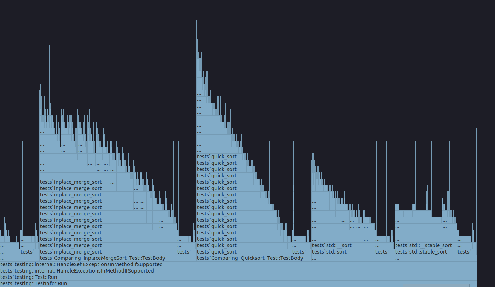

### Флеймграфы ###

  

  

  

### Сложности написанных алгоритмов ###

  

### Выводы ###
При проведении сравнительного анализа всех написанных алгоритмов сортировки было установлено,
что, как и ожидалось, самым долгим является алгоритм сортировки вставками. Далее
по скорости идёт алгоритм in-place алгоритм сортировки слиянием, алгоритм сортировки слиянием,
затем алгоритм heap_sort. Конкретно для данного датасета алгоритм quick_sort работает несколько
быстрее алгоритма пирамидальной сортировки, и при этом является наиболее быстрым среди
написанных алгоритмов. Стандартные алгоритмы сортировки c++ (std::sort, std::stable_sort и т.п.)
работают намного лучше, однако не сильно уступают алгоритму quick_sort (на ~20 мс), что, скорее всего,
связано с работой стандартных алгоритмов **в зависимости** от входного массива: в одном случае
используется один алгоритм сортировки, являющийся оптимальным конкретно
для данного массива, в другом случае - другой (таким образом, алгоритм является
стабильным, то есть работающим за одно и то же время).

### Логи ###
Логи, содержащие время выполнения смотреть в папке [misc](misc)
